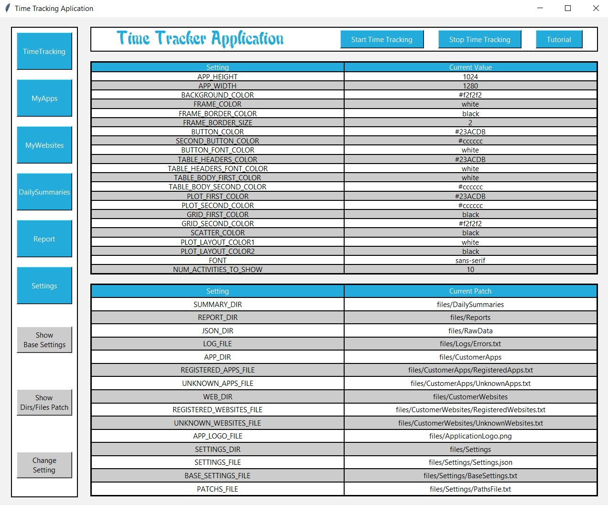
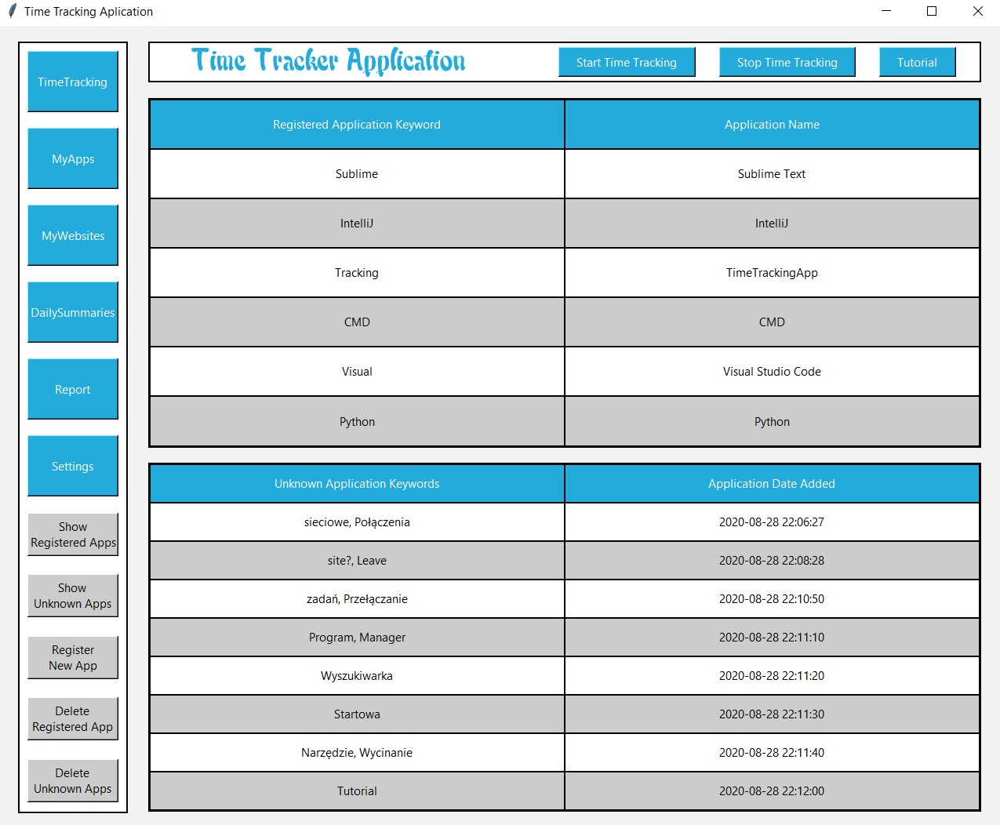
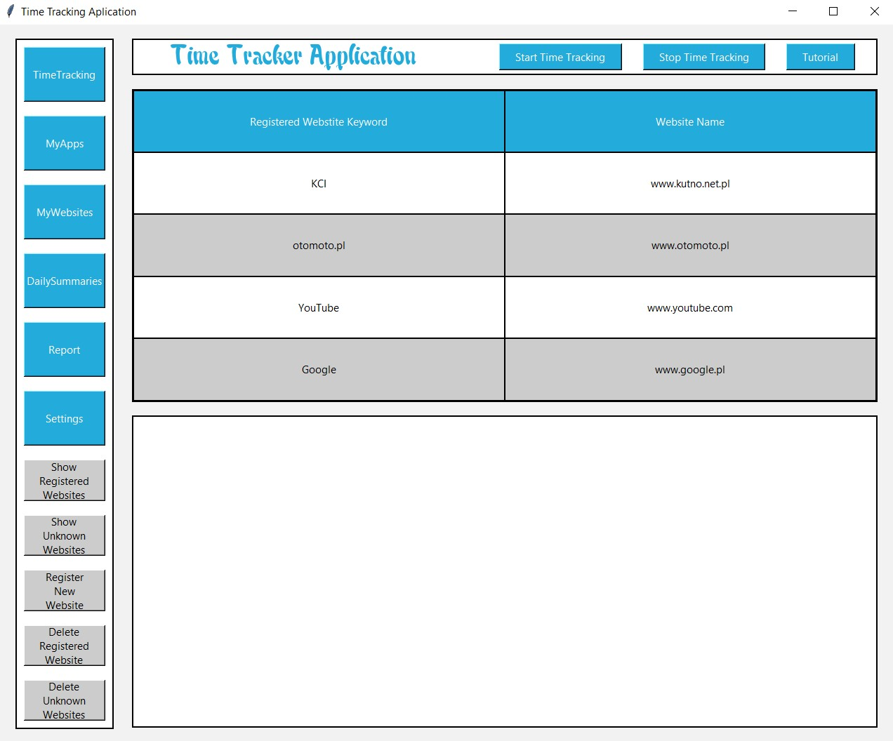
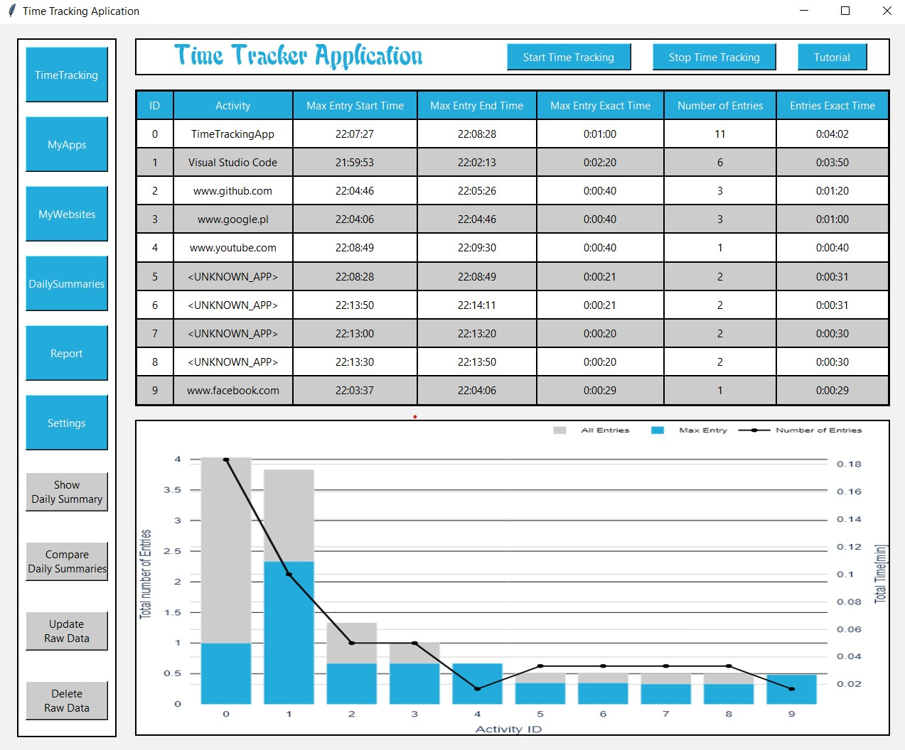
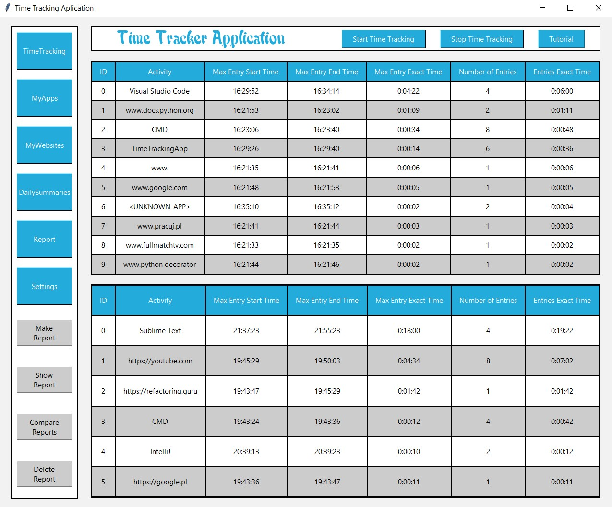
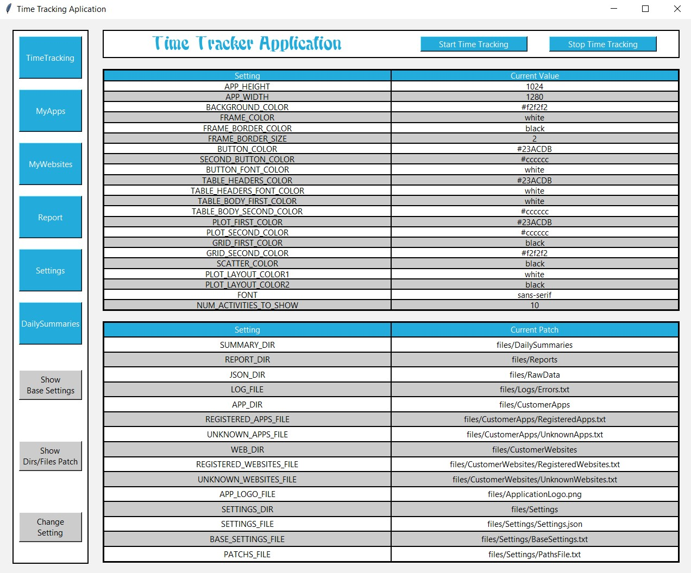

# TimeTrackingApp

## Overview
The goal of this project is to build real-time tracking application. This application is compatible with the Windows operating system and the Google Chrome browser. 
You can use it program to see how much time you spend on a specific desktop app or website. 

## Inspiration
The inspiration for this project was taken from https://www.youtube.com/watch?v=ZBLYcvPl1MA&t=796s.

## Requirements
* python 3.8
* tkinter
* pandas
* numpy
* matplotlib
* plotly
* pillow
* uiautomation
* win32

## Features
* Real-time tracking of desktop applications and websites
* Automatically save raw data every 2 minutes or when exiting the program
* Automatic change of raw data saving after date change (at 00:00)
* Updating real-time summary and graph every 3 minutes 
* Logging error and continuing to run the application in the event of non-critical errors (files/logs/errors.txt)
* Registering your desktop applications and websites to make reports more clearly and user-friendly
* Viewing and comparing daily activity summaries
* Merging several daily activity summaries into reports (e.g. weekly or monthly reports) and then comparing them
* Adjusting the appearance of the application to user needs

## Content
* <i>requirements.txt</i> - file with all required packages
* <i>main.py</i> - script to run application
* <i>backend</i> - folder contains all packages/modules related to the backend
* <i>user_interface</i> - folder contains all packages/modules related to the user interface
* <i>files</i> - folder contains all hepler files like: raw data, reports, setting files, images
* <i>settings</i> - separate settings package

## How to run application
- <i>Download repository</i> - git clone https://github.com/Cyki89/RealTimeTrackingApplication.git.
- <i>Create new virtual enviroment</i> - mkvirtualenv --python=<your python 3.8 location> virtualenv_name.
- <i>Install dependecies</i> - pip install -r requirements.txt.
- <i>Go to main application folder</i> - cd TimeTrackingApp.
- <i>Run script main.py on your local machine</i> - python main.py.
- See the tutorial below on how to use this application

# Tutorial

## TimeTracking

- Click button <b>"Start Time Tracking"</b> to start time tracking
- Click button <b>"Stop Time Tracking"</b> to stop time tracking
- Click button <b>"Tutorial"</b> to see application guide in web browser
- In the upper frame you can see the daily activity summary, refreshed every 2 minutes
- In the lower frame you can see the daily activity summary plot, refreshed every 2 minutes
- If you see <b><UNKNOWN_APP></b> in the table then you should register the application (see MyApps section)
- If you see <b><UNKNOWN_WEBSITE></b> in the table then you should register the website (see MyWebsites section)

## MyApps

- Click the <b>"Show Registered Apps"</b> button to see the registered desktop applications and their identifying keywords
- Click the <b>"Show Unknown Apps"</b> button to see the unknown desktop applications identifying keywords and their added date to the system
- Click the <b>"Register New App"</b> button and enter desktop application identifying keyword and name to register new application
- Click the <b>"Delete Registered App"</b> button and enter desktop application identifying keyword to remove registered application from the system
- Click the <b>"Delete Unknown Apps</b>" button to remove all registered desktop applications from the system
- <b>Restart</b> apllication after all delete/add operations

## MyWebsites

- Click the <b>"Show Registered Websites"</b> button to see the registered websites and their identifying keywords
- Click the <b>"Show Unknown Websites"</b> button to see the unknown websites identifying keywords and their added date to the system
- Click the <b>"Register New Website"</b> button and enter website identifying keyword and name to register new website
- Click the <b>"Delete Registered Website"</b> button and enter applications identifying keyword to remove registered application from the system
- Click the <b>"Delete Unknown Websites"</b> button to remove all registered websites from the system
- <b>Restart</b> apllication after all delete/add operations

## DailySummaries

- Click the <b>"Show Daily Summaries"</b> button and select file to see daily summary
- Click the <b>"Compare Daily Summaries"</b> button and select files to compare daily activities (by summary tables)
- Click the <b>"Update Raw Data"</b> button and select json file to update activity name in raw data - usefull when you registered new desktop application or website
- Click the <b>"Delete Raw Data"</b> button to delete raw json file and coresponding daily summary from the system

## Report

- Click the <b>"Make Report"</b> button and select daily summaries to create an activity report for several days (e.g. weekly report)
- Click the <b>"Show Report"</b> button to see previously created activity report (summary and plot)
- Click the <b>"Compare Reports"</b> button and select files to compare activity reports (by summary tables)
- Click the <b>"Delete Report"</b> button to delete activity report

## Settings

- Click the <b>"Show Base Settings"</b> button to see application appearance settings
- Click the <b>"Show Files/Dir Patch"</b> button to see dirs/files patchs 
- Click the <b>"Change Setting"</b> button to change application appearance settings or dirs/files patchs
